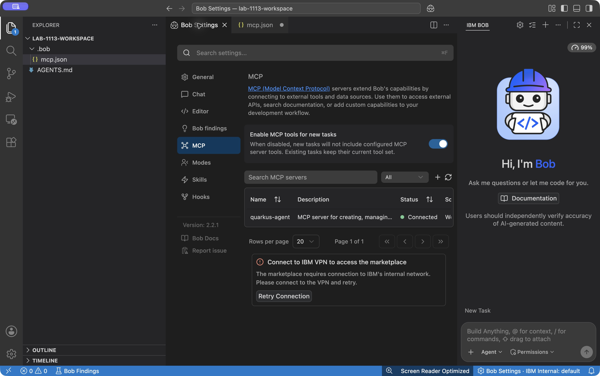
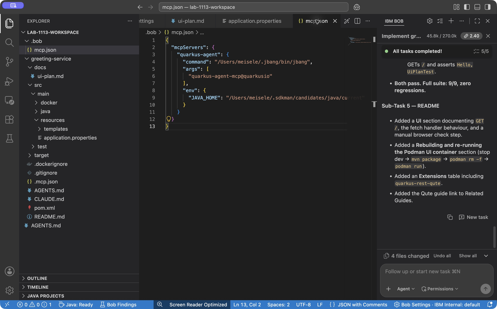
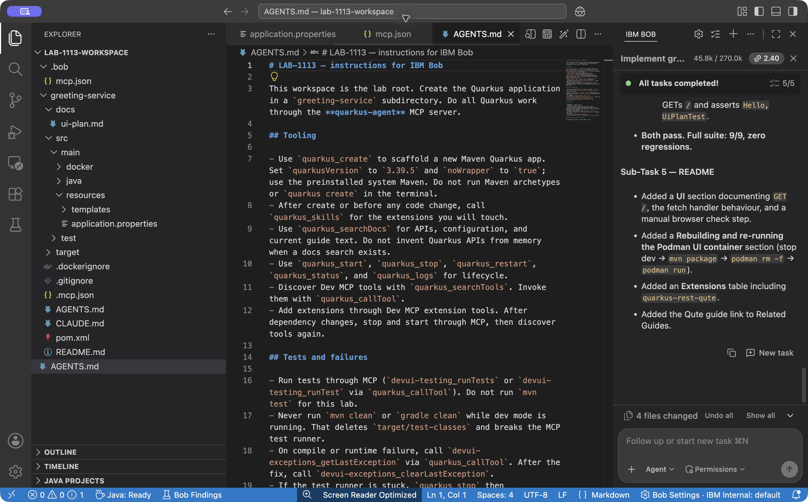

# Configure the Quarkus Agent MCP

**Time:** 15 minutes

**Mode:** Agent (or Advanced)

Bob does not ship Quarkus knowledge as a plugin. You connect a local MCP server that can create apps, start dev mode, read skills, search docs, and proxy Dev MCP tools such as the test runner.

## Enable MCP in Bob

1. Click the **Settings** icon in the Bob panel.
2. Open the **MCP** tab.
3. Enable **Enable MCP tools for new tasks** (called **Use MCP Servers** in some earlier builds).

For more information, see [Using MCP in Bob](https://docs.bob.ibm.com/docs/ide/configuration/mcp/mcp-in-bob).



## Add the Quarkus Agent server

Bob launched from the desktop inherits the **system PATH**, not your shell PATH. SDKMAN installs JBang and Java on the shell PATH only, so `command: "jbang"` often fails with `spawn jbang ENOENT`. Use absolute paths.

1. In the MCP tab, click **Add MCP Server**, or the `+` icon, and select the **lab-1113-workspace** configuration space. Click **Open Configuration File**. Bob creates `.bob/mcp.json` in the workspace if needed.
2. Replace the file contents with the following JSON. Substitute the paths you recorded from `which jbang` and `echo "$JAVA_HOME"`.

```json
{
  "mcpServers": {
    "quarkus-agent": {
      "command": "/home/YOUR_USER/.sdkman/candidates/jbang/current/bin/jbang",
      "args": ["quarkus-agent-mcp@quarkusio"],
      "env": {
        "JAVA_HOME": "/home/YOUR_USER/.sdkman/candidates/java/current"
      }
    }
  }
}
```

Replace both `/home/YOUR_USER/...` example paths with the real absolute paths from your machine before Bob starts the server.



3. Save the file.
4. In MCP settings you see the `quarkus-agent` server configured. Hit **refresh all servers** if it does not connect on its own.
5. Expand the server entry. Confirm tools such as `quarkus_agent_log`, `quarkus_skills`, `quarkus_searchDocs`, and `quarkus_callTool` appear.

The first start can take a minute. JBang downloads `quarkus-agent-mcp@quarkusio` from Maven Central. Semantic doc search can also start a local documentation container through Podman. If search reports that version-specific documentation is unavailable, inspect the returned version and verify the result against the 3.39.5 build; do not upgrade the application to match the search index.

If the server stays red or tools never appear, see [MCP tools never appear](../troubleshooting.md#mcp-tools-never-appear) and [Quarkus Agent MCP server fails to start](../troubleshooting.md#quarkus-agent-mcp-server-fails-to-start).

## Review tool approvals

Bob 2.2.1 labels the control below the chat input **Permissions**. Earlier builds can label it **Auto-Approve**. Leave edit and command approvals enabled, review each proposed action, and choose **Approve once** when it matches the task. This walkthrough works with individual MCP approvals.

If you choose auto-approval, review the [Bob approval documentation](https://docs.bob.ibm.com/docs/ide/features/auto-approving-actions) first. It skips the corresponding confirmation prompts. The lab does not require changing your existing permission policy.

## Add AGENTS.md for Quarkus MCP

Bob is stateless between conversations. An `AGENTS.md` file in the **workspace root** is the persistent instruction file Bob loads at the start of each chat. Without it, later prompts have to repeat "use Quarkus MCP" and Bob can fall back to raw Maven.

Do **not** run `/init` in this empty folder. `/init` scans existing code; there is none yet, and it would not add the Quarkus MCP rules.

1. In the workspace root, create a file named `AGENTS.md`.
2. Paste the following contents into it.

```markdown
# LAB-1113 — instructions for IBM Bob

This workspace is the lab root. Create the Quarkus application in a `greeting-service` subdirectory. Do all Quarkus work through the **quarkus-agent** MCP server.

## Tooling

- Use `quarkus_create` to scaffold a new Maven Quarkus app. Set `quarkusVersion` to `3.39.5` and `noWrapper` to `true`; use the preinstalled system Maven. Do not run Maven archetypes or `quarkus create` in the terminal.
- After create or before any code change, call `quarkus_skills` for the extensions you will touch.
- Use `quarkus_searchDocs` for APIs, configuration, and current guide text. Do not invent Quarkus APIs from memory when a docs search exists.
- Use `quarkus_start`, `quarkus_stop`, `quarkus_restart`, `quarkus_status`, and `quarkus_logs` for lifecycle.
- Discover Dev MCP tools with `quarkus_searchTools`. Invoke them with `quarkus_callTool`.
- Add extensions through Dev MCP extension tools. After dependency changes, stop and start through MCP, then discover tools again.

## Tests and failures

- Run tests through MCP (`devui-testing_runTests` or `devui-testing_runTest` via `quarkus_callTool`). Do not run `mvn test` for this lab.
- Never run `mvn clean` or `gradle clean` while dev mode is running. That deletes `target/test-classes` and breaks the MCP test runner.
- On compile or runtime failure, call `devui-exceptions_getLastException` via `quarkus_callTool`. After the fix, call `devui-exceptions_clearLastException`.
- If the test runner is stuck, `quarkus_stop` then `quarkus_start`.

## This lab

- groupId: `com.ibm.txc.lab`
- artifactId: `greeting-service`
- Container runtime: Podman. Do not install Docker.
- Keep the Quarkus platform BOM and Maven plugin at 3.39.5. The lab machines have Maven dependencies for this version pre-populated. Do not upgrade.
- Package a JVM container image only after `quarkus_stop`. `mvn package -Dquarkus.container-image.build=true` is allowed after stop.
- Keep Dev Services in dev: do not set `quarkus.datasource.jdbc.url` except on the `%prod.` profile.
```

3. Save the file at `~/lab-1113-workspace/AGENTS.md` (or the empty folder you opened).
4. Click **+** (**New Task**; **New chat** in some builds) so the next conversation loads `AGENTS.md`. See [Start a project with /init and AGENTS.md](https://bob.ibm.com/docs/ide/tutorials/start-a-project).



`quarkus_create` may later add a `CLAUDE.md` or `AGENTS.md` **inside** `greeting-service/`. Leave the workspace-root `AGENTS.md` in place. That is the file Bob reads for this lab.

## Checkpoint: list the tools

Switch to **Agent** mode if you have not already.

Paste this prompt:

```text
Read AGENTS.md in this workspace. List the Quarkus MCP tools you can use.
For each of quarkus_create, quarkus_skills, quarkus_searchDocs, and
quarkus_callTool, explain in one sentence when you should call it in this lab.
```

You should see a tool list from the connected `quarkus-agent` server, not a generic guess. Bob should treat `quarkus_skills` as required **before** writing code, matching `AGENTS.md`.

!!! success "Stop and verify"
    `quarkus-agent` is connected, `AGENTS.md` is in the workspace root, and you can explain why skills come before code.
