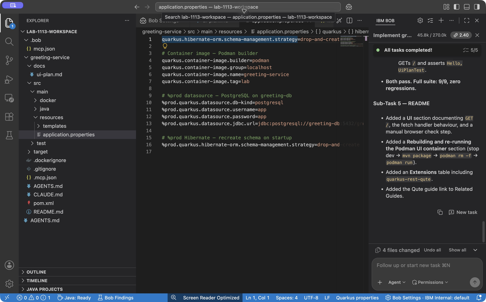

# Containerize with Podman

**Time:** 22 minutes

**Mode:** Agent (or Advanced)

Dev Services exist only in dev and test. A container image runs as **prod**. Prod does not start Postgres for you, so the image must talk to a database you run explicitly.

This section follows the same build-and-run idea as [Containerizing Quarkus applications and deploying them with Kubernetes](https://developer.ibm.com/tutorials/quarkus-basics-06/): add a container-image extension, build with Podman, run the image. This lab stops at Podman on the VM. Kubernetes manifests are optional further reading, not a lab requirement.

You will:

1. Add `quarkus-container-image-podman` through MCP while dev mode is running, then stop dev mode.
2. Configure the image and a **prod-only** datasource.
3. Build `localhost/greeting-service:lab`.
4. Run Postgres and the app on one Podman network.
5. Repeat the POST/GET checks against the mapped port.

## Build the image and prepare prod config

Paste this prompt:

```text
Containerize greeting-service for Podman using Quarkus container-image support.

Steps:
1. Call quarkus_skills and quarkus_searchDocs for container-image / Podman
2. Add quarkus-container-image-podman through the MCP extension tool while
   dev mode is running (not Docker, not Jib)
3. Stop the app with quarkus_stop before packaging
4. Set:
   quarkus.container-image.builder=podman
   quarkus.container-image.group=localhost
   quarkus.container-image.name=greeting-service
   quarkus.container-image.tag=lab
5. Add %prod datasource config for PostgreSQL:
   - host/service name: greeting-db
   - database: greetings
   - username/password: app / app
   - jdbc url: jdbc:postgresql://greeting-db:5432/greetings
   - %prod.quarkus.hibernate-orm.schema-management.strategy=drop-and-create
   Keep Dev Services working in dev: do not set jdbc.url outside %prod
6. Keep Quarkus 3.39.5. Package and build the JVM image (not native) with
   mvn package -Dquarkus.container-image.build=true
7. Give me exact podman commands to:
   - create a network greeting-net
   - run postgres:16 as greeting-db on that network
   - wait for pg_isready in greeting-db before starting the app
   - run localhost/greeting-service:lab as greeting-app, publish 8080
   - curl POST and GET /api/greetings

Do not install Docker.
```

**Watch for:**

- `quarkus_stop` before the package/image build.
- Extension `quarkus-container-image-podman` in the project.
- Image coordinates in `application.properties` (or `application.properties` plus profile files).
- `%prod.` prefixes on the datasource URL. If those properties are unprefixed, the next `quarkus_start` will skip Dev Services.



The prod schema setting `drop-and-create` creates the tables for this lab and clears existing rows on every app startup. A real production app uses Flyway or Liquibase and `schema-management.strategy=none` (or `validate`). Do not copy `drop-and-create` into a production system.

## Review prod configuration

`application.properties` should contain entries equivalent to:

```properties
quarkus.hibernate-orm.schema-management.strategy=drop-and-create

# Container image (Podman)
quarkus.container-image.builder=podman
quarkus.container-image.group=localhost
quarkus.container-image.name=greeting-service
quarkus.container-image.tag=lab

# Production datasource (Dev Services stays active in dev/test)
%prod.quarkus.datasource.db-kind=postgresql
%prod.quarkus.datasource.username=app
%prod.quarkus.datasource.password=app
%prod.quarkus.datasource.jdbc.url=jdbc:postgresql://greeting-db:5432/greetings
%prod.quarkus.hibernate-orm.schema-management.strategy=drop-and-create

```

The JDBC host `greeting-db` is a **container name** on the Podman network, not `localhost`. From inside the app container, `localhost` is the app itself.

## Run Postgres and the app

Use Bob's commands if they differ in image tag or ports. One working sequence is:

```bash
podman network create greeting-net

podman run -d --name greeting-db --network greeting-net \
  -e POSTGRES_USER=app \
  -e POSTGRES_PASSWORD=app \
  -e POSTGRES_DB=greetings \
  docker.io/library/postgres:16

until podman exec greeting-db pg_isready -U app -d greetings; do
  sleep 1
done

podman run -d --name greeting-app --network greeting-net \
  -p 8080:8080 \
  localhost/greeting-service:lab
```

After the app starts, check the image and both containers:

```bash
podman images | grep greeting-service
podman ps
```

Both `greeting-db` and `greeting-app` should be running. If the app container restarts, inspect logs:

```bash
podman logs greeting-app
```

A typical failure is `Connection refused` to `greeting-db`: wrong network, wrong hostname, or Postgres still starting. See [Podman errors](../troubleshooting.md#podman-errors) and [Container cannot reach PostgreSQL](../troubleshooting.md#container-cannot-reach-postgresql).

Check Bob’s README edits too: endpoint examples must use `/api/greetings`, and dev startup must use MCP. Review generated commands before approving them.

## Prove the containerized API

```bash
curl -i -X POST http://localhost:8080/api/greetings \
  -H "Content-Type: application/json" \
  -d '{"name":"Container"}'

curl http://localhost:8080/api/greetings
```

Replace `8080` if you published a different host port.

!!! success "Stop and verify"
    `podman images` lists `localhost/greeting-service:lab`. `podman ps` shows the database and the app. POST/GET against the published port persist a greeting.

If port 8080 is still held by a leftover dev-mode process, stop it (`quarkus_stop` or identify the process) and recreate the app container.

Continue to [Wrap up](wrap-up.md) to finish the core lab, or try [Optional: Plan a Qute UI](qute-ui.md) if you have about 15 minutes remaining.
