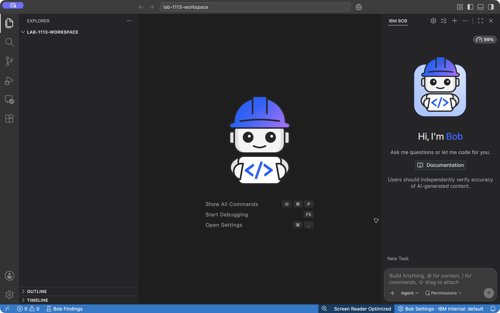

# Check the lab environment

**Time:** 10 minutes

Lab machines are pre-provisioned with IBM Bob, Podman, the Quarkus CLI, JBang, and SDKMAN (Java and Maven). You still sign in and confirm the versions on *this* machine.

The screenshots were captured in **IBM Bob 2.2.1 on macOS** with Quarkus Agent MCP 1.0.10. Linux lab machines have different window controls and paths; follow the stated values for your machine.

Use **Quarkus 3.39.5** throughout this lab. The lab machines have Maven dependencies for this version pre-populated. The Quarkus CLI version can differ; the create prompt below pins the application's platform BOM and Maven plugin to 3.39.5. Do not upgrade the application during the lab.

## Install or verify IBM Bob

If Bob is already on the applications menu, launch it and continue with sign-in.

If Bob is missing or will not start, follow [Installing IBM Bob](https://docs.bob.ibm.com/docs/ide/getting-started/install):

1. Download the installer for your OS and CPU from [bob.ibm.com/download](https://bob.ibm.com/download).
2. On Linux lab VMs, install the `.rpm` or `.deb` package for your distribution.
3. Launch Bob from the applications menu or desktop shortcut.

## Sign in with IBMid

Sign-in is required before MCP configuration.

1. On first launch, complete the browser authentication flow with your **IBMid**.
2. Return to Bob after authentication succeeds.
3. If you do not have an IBMid, create one at [IBM account signup](https://www.ibm.com/account/reg/us-en/signup?formid=urx-19776).

If sign-in hangs on the lab network, the environment might need to allow `login.ibm.com`. See [Configuring firewall rules](https://docs.bob.ibm.com/docs/ide/troubleshooting/ts-firewall-rules) in the Bob docs.

!!! success "Stop and verify"
    Bob opens, the chat panel is available, and you are signed in (no repeated login prompt).



## Confirm the toolchain versions

Open the **Bob integrated terminal**. Maven on lab machines is installed through **SDKMAN**. Source SDKMAN in this terminal before you check versions. On the Mac used for these screenshots, Maven is installed through Homebrew; `sdk current maven` can therefore report no selected version while `mvn -version` succeeds:

```bash
source "$HOME/.sdkman/bin/sdkman-init.sh"

java -version
mvn -version
sdk current java
sdk current maven
quarkus -v
jbang --version
podman --version
podman info
```

Lab images typically install Java through SDKMAN (for example IBM Semeru 25), Maven 3.9.x, a current Quarkus CLI, JBang, and Podman from the OS repositories. Your patch versions can differ.

**Confirm:**

- `mvn -version` reports Apache Maven 3.9.x (SDKMAN on the lab machines).
- `sdk current maven` shows the active Maven candidate.
- `quarkus -v`, `jbang --version`, and `podman info` all succeed.

Record two paths. You will paste them into MCP configuration in the next section:

```bash
which jbang
echo "$JAVA_HOME"
```

If `JAVA_HOME` is empty, print the SDKMAN Java home:

```bash
echo "$HOME/.sdkman/candidates/java/current"
```

!!! success "Stop and verify"
    Every command in the version block exits with code 0, and you have a full path to `jbang` plus a `JAVA_HOME` directory. If `mvn` is missing, see [Maven not found (SDKMAN)](../troubleshooting.md#maven-not-found-sdkman).

## Open an empty workspace

Do the lab in a dedicated folder, not inside this documentation repository. The folder is empty on purpose. You have not created the app yet.

1. Create an empty folder, for example `~/lab-1113-workspace`.
2. In Bob, choose **File → Open Folder** and select that folder.
3. Confirm the explorer shows an empty workspace. The next sections add MCP configuration, then `AGENTS.md`, then the Quarkus app.
4. If you see at the top bar a message like: **Trust this folder to enable all feautues**, then click on **Manage** link and in the pop up window the **Trust** button.

If the chat panel is hidden, click the Bob icon in the navigation bar, or press **Option + Command + B** (macOS) / **Ctrl + Alt + B** (Windows/Linux). See the [Bob Quickstart](https://docs.bob.ibm.com/docs/ide/getting-started/quickstart).
