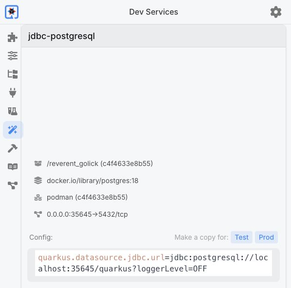

# Add persistence

**Time:** 22 minutes

**Mode:** Agent (or Advanced)

The JSON greeting so far is computed from the query parameter on every request; it is not stored. Next, store greetings in PostgreSQL and list them. Dev Services starts the development database so you do not configure a separate Postgres instance by hand.

Quarkus starts a PostgreSQL container through Podman when all of the following are true:

- A JDBC PostgreSQL extension is on the classpath.
- You have **not** set `quarkus.datasource.jdbc.url` in the default (dev/test) config.
- Podman (or Docker) is available.

That is Dev Services. It is the same idea described in the IBM Developer [Quarkus REST](https://developer.ibm.com/tutorials/create-simple-rest-app-quarkus/) material: you do not stand up Postgres by hand for `quarkus dev`.

Predict this before you paste the prompt: after a POST, a following GET should return the same greeting, including an id assigned by the database.

## Persist greetings through Panache

1. Start a new chat
2. Paste this prompt:

```text
Add PostgreSQL persistence to greeting-service.

Extensions:
- hibernate-orm-panache
- jdbc-postgresql

Behavior:
- POST /api/greetings with JSON {"name": "Lab"} creates a row and returns 201
  with id, name, and message (message = "Hello, {name}")
- GET /api/greetings lists all stored greetings
- GET /api/greetings/{id} returns one greeting or 404

Rules:
- Call quarkus_skills separately for Panache, Hibernate ORM, and REST before editing
- Add extensions through MCP extension tools, then stop/start through MCP
- Keep the Quarkus platform and Maven plugin at 3.39.5
- Use a Panache entity (active record is fine)
- Annotate write operations with @Transactional
- Do NOT set quarkus.datasource.jdbc.url in the default config — use Dev Services
- Add or update tests and run them through Quarkus MCP tools
- After tests pass, tell me how to verify POST then GET with curl
```

**Watch for:**

- Bob adds extensions through MCP (`quarkus_callTool` / extension tools), not by editing `pom.xml` from memory.
- `quarkus_skills` runs **before** the entity and resource appear.
- Application logs mention a Dev Services PostgreSQL container.
- Writes use `@Transactional`. Without it, `persist()` fails or never commits.

3. Open the Quarkus Dev UI at http://localhost:8080/q/dev-ui/dev-services. Check that `jdbc-postgresql` has a running container and a generated JDBC URL. The Dev Services image version and port can differ from the explicit PostgreSQL 16 container used later.



## Review the shape of the code

Bob's class names can differ. The structure should match this pattern from [Hibernate ORM with Panache](https://quarkus.io/guides/hibernate-orm-panache):

```java
@Entity
public class Greeting extends PanacheEntity {

    public String name;
    public String message;

    public static Greeting of(String name) {
        Greeting g = new Greeting();
        g.name = name;
        g.message = "Hello, " + name;
        return g;
    }
}
```

`PanacheEntity` provides the `id` field. Public fields are the Panache convention.


```java
@Path("/api/greetings")
public class GreetingResource {

    @GET
    public List<Greeting> list() {
        return Greeting.listAll();
    }

    @POST
    @Transactional
    public Response create(GreetingRequest request) {
        Greeting greeting = Greeting.of(request.name());
        greeting.persist();
        return Response.status(Response.Status.CREATED).entity(greeting).build();
    }
}
```

Your generated types will not match this snippet character for character. Check the behaviors: entity extends `PanacheEntity` (or uses a Panache repository), POST is `@Transactional`, and GET does not open a write transaction it does not need.

If `application.properties` now contains `quarkus.datasource.jdbc.url` **without** a `%prod.` prefix, Dev Services stay off. Ask Bob to remove the default URL so only the prod profile (next section) points at an explicit database.

## Verify POST then GET

Use the URLs Bob reported if they differ.

Create a greeting:

```bash
curl -i -X POST http://localhost:8080/api/greetings \
  -H "Content-Type: application/json" \
  -d '{"name":"Lab"}'
```

You should see HTTP 201 and a body that includes `"name":"Lab"` and a `message` such as `Hello, Lab`, plus a numeric `id`.

List greetings:

```bash
curl http://localhost:8080/api/greetings
```

The array must include the row you just posted. Fetch that row by the numeric `id` returned by POST (replace `1` below), then check a missing ID:

```bash
curl -i http://localhost:8080/api/greetings/1
curl -i http://localhost:8080/api/greetings/999999
```

The first request returns HTTP 200 and the same row. The second returns HTTP 404 if that ID does not exist. These rows are stored in PostgreSQL. With the lab's `drop-and-create` schema setting, restarting the application recreates the tables and clears their contents.

!!! success "Stop and verify"
    POST returns 201 with an id. GET `/api/greetings` and GET by that id return the row. A missing id returns 404. MCP tests pass.

If POST fails with a transaction or persistence error, ask Bob:

```text
POST /api/greetings failed. Call quarkus_skills for Panache, then
devui-exceptions_getLastException via quarkus_callTool, fix the issue,
re-run tests via MCP, and clear the exception.
```
