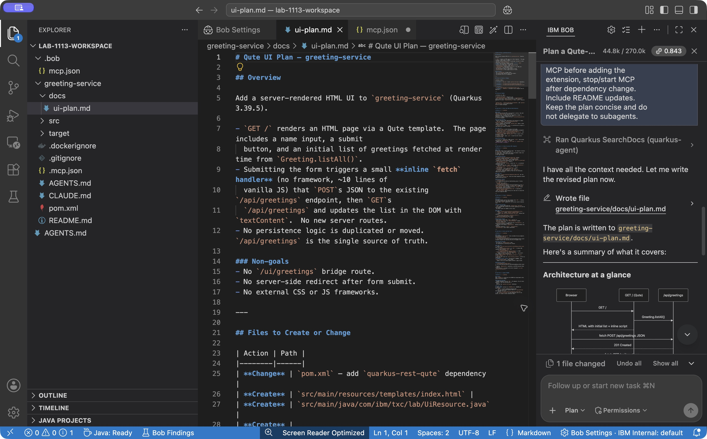
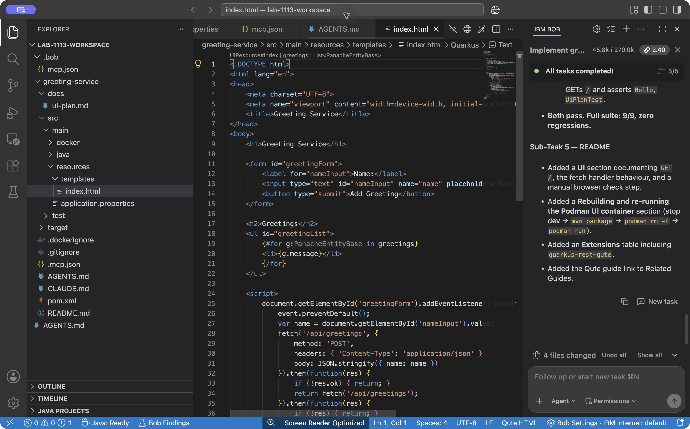
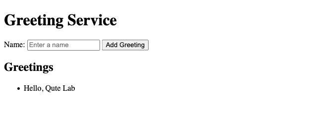

# Optional: Plan a Qute UI

**Time:** ~15 minutes if you are ahead

This stretch is not required for the lab outcome. It practices Bob **Plan** mode: write a bounded plan, start a **new chat**, then implement.

Before starting this stretch, stop the app container so dev mode can use port 8080:

```bash
podman stop greeting-app
```

Leave `greeting-db` available for the later container check. Dev mode uses its own Dev Services database.

1. Switch to **Plan** mode.
2. Paste:

```text
Plan a Qute-based UI for greeting-service. Do not implement yet.

Goals:
- GET / shows an HTML page with a form: text input for name, submit button
- Submitting sends JSON to POST /api/greetings, then GET /api/greetings
  refreshes the list; use a small fetch handler and textContent, no JS framework
- Keep the initial HTML server-rendered by Qute; do not add a second write endpoint
- Keep everything in this Quarkus app (Qute templates under src/main/resources/templates)
- List files to create or change, extensions needed, and a test plan

Write the plan to greeting-service/docs/ui-plan.md only.
```

3. Open `greeting-service/docs/ui-plan.md` and confirm the scope: Qute in this app, no separate SPA, no extra database product.



4. Click **+** (**New Task**; **New chat** in some builds) so planning discussion does not fill the implementation context. See [Delegate bounded implementation tasks](https://docs.bob.ibm.com/docs/ide/getting-started/tutorials/delegate-bounded-tasks).

5. Switch to **Agent** mode and paste:

```text
Implement greeting-service/docs/ui-plan.md exactly.

Rules:
- Call quarkus_skills separately for Qute and REST before coding; if no Qute
  skill is available, use quarkus_searchDocs for Qute integration guidance
- Use Qute templates; server-side render the page
- Reuse POST /api/greetings and GET /api/greetings
- Add or update tests; run tests via Quarkus MCP tools
- Start with quarkus_start, then add extensions through MCP and stop/start
  through MCP after dependency changes
- Keep Quarkus 3.39.5
- Update README.md with MCP startup instructions for dev and the stop,
  rebuild, and recreate steps needed to get this UI into the Podman image
```

6. Open `http://localhost:8080/` (or the port Bob reports), submit a name, and confirm the greeting appears. Reload the page and check that the stored greeting is still shown.

The image built earlier does not contain the new UI. To test the UI in Podman, ask Bob to stop dev mode with `quarkus_stop` and run `mvn package -Dquarkus.container-image.build=true` again. Recreate `greeting-app` from the rebuilt image on `greeting-net` using the same run command, then repeat the browser check. With `drop-and-create`, the app startup clears the lab database rows.





For more information on Plan mode, see [Plan and implement complex features](https://docs.bob.ibm.com/docs/ide/getting-started/tutorials/partner-with-a-coding-agent).
