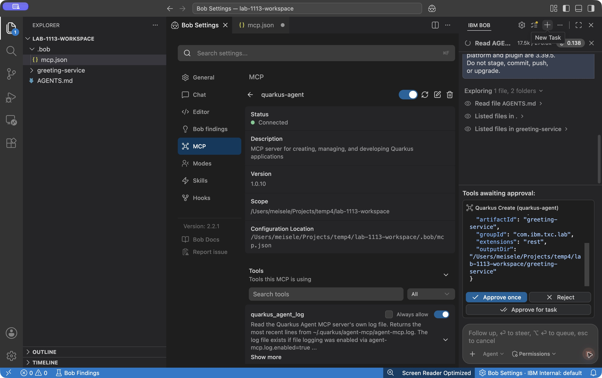

# Create the REST service

**Time:** 15 minutes

**Mode:** Agent (or Advanced)

This is the first worked slice. Bob creates the app through MCP, the app starts in dev mode, and you prove the default endpoint with `curl`. After that, you ask for one JSON greeting endpoint and tests.

## Create greeting-service

1. In the Bob integrated terminal, create an empty application directory under the workspace root:

```bash
mkdir -p greeting-service
```

2. Create a new task with **+** (**New Task**; called **New chat** in some earlier builds).
3. Paste this prompt:

```text
Use the Quarkus MCP agent to create a new Maven Quarkus application in this workspace.

- artifactId: greeting-service
- groupId: com.ibm.txc.lab
- extensions: rest
- Quarkus version: 3.39.5 exactly (quarkusVersion: "3.39.5")
- Use the existing empty greeting-service subdirectory as outputDir
- Set createInCurrentDir: true
- Include starter code (not noCode)
- Set noWrapper: true; use the preinstalled system Maven
- After creation, call quarkus_skills for the REST extension before changing any code

When the app is running, tell me the URL to hit for the default hello endpoint.
Do not run Maven create or quarkus:dev by hand. Use quarkus_create.
Do not upgrade Quarkus.
```

This lab uses system Maven because the MCP server can reject an untracked Maven wrapper in a new workspace. If creation reports that the output directory does not exist, check that `greeting-service` exists inside the workspace. See [Maven wrapper rejected by MCP](../troubleshooting.md#maven-wrapper-rejected-by-mcp).

**Watch for:**

1. Bob calls `quarkus_create`. Approve the MCP tool if prompted.
2. Bob presents a todo list. Approve it if prompted.
3. Bob waits for the initial build and dev mode.
4. Bob calls `quarkus_skills` before suggesting further code changes.
5. The REST codestart exposes a default hello endpoint (often `/hello`).

Open `greeting-service/pom.xml`. Confirm `quarkus.platform.version` is `3.39.5` and that both the platform BOM and `quarkus-maven-plugin` use that property.



If Bob reports a different port than 8080, use that port in every `curl` and browser URL for the rest of the lab. Dev mode can pick another port when 8080 is already bound.

## Hit the hello endpoint

In the Bob terminal, call the URL Bob reported:

```bash
curl -i http://localhost:8080/hello
```

The output is similar to the following (path and body can differ):

```text
HTTP/1.1 200 OK
content-length: 23
Content-Type: text/plain;charset=UTF-8

Hello from Quarkus REST
```

!!! success "Stop and verify"
    HTTP 200 and a response body from the REST codestart.

## Add a JSON greeting endpoint

1. Start a new chat
2. This step fades the scaffolding: you specify the contract, not the class names. Paste:

```text
Add a GET endpoint at /api/greeting?name=YourName that returns JSON:
{"message": "Hello, YourName"}.

Rules:
- Call quarkus_skills for REST before editing
- Add rest-jackson through MCP extension tools for JSON serialization
- After adding the extension, use quarkus_stop then quarkus_start
- Keep the Quarkus platform and Maven plugin at 3.39.5
- Add a test
- Run tests through Quarkus MCP testing tools (quarkus_searchTools + quarkus_callTool),
  not mvn test
- Do not add a database yet
```

3. Validate and approve tool calls as Bob asks for them.

**Watch for:** Bob uses `quarkus_callTool` with a testing tool such as `devui-testing_runTests`. If tests get stuck with "Tests already in progress", ask Bob to run `quarkus_stop` then `quarkus_start` through MCP. Do **not** run `mvn clean` while dev mode is running; it deletes `target/test-classes` and breaks the MCP test runner.

Verify the contract yourself:

```bash
curl "http://localhost:8080/api/greeting?name=Lab"
```

Expected shape (whitespace may differ):

```json
{"message": "Hello, Lab"}
```

Open the resource class Bob created. You should see a Jakarta REST resource with a `@QueryParam` (or equivalent) and a JSON response. If the file looks unrelated to this contract, paste the `curl` output back into chat and ask Bob to match it.

!!! success "Stop and verify"
    The query parameter changes the JSON `message`, and MCP-run tests pass.

!!! danger "Do not run mvn clean while dev mode is running"
    If tests fail, ask Bob to use `devui-exceptions_getLastException` via `quarkus_callTool`. See [Tests fail or runner stuck](../troubleshooting.md#tests-fail-or-runner-stuck).
